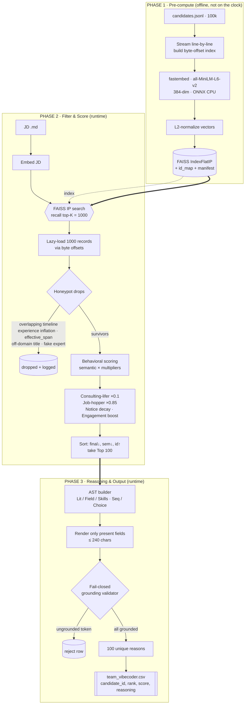

# Redrob Rank Engine — Team Vibecoder

> Rank the **Top 100** candidates out of **100,000** for one job description —
> on a **single CPU**, in **~4.3 seconds**, with a **written, verifiable reason
> for every pick** and **zero hallucinations**. No GPU. No LLM at rank time. No
> network. Same input → same output, byte-for-byte.

This is a retrieval-and-rerank system built on **math and logic**, not an LLM
wrapper. Reasoning can't lie because it's generated from the candidate's own
fields by a typed AST and rejected if any token isn't grounded.

> **Grit > Resources.** Built, coded, and shipped single-handedly by
> **Daksh Rawat** — Solo Founder, Architect & Engineer — from an **iPhone** and a
> **Jio Cloud PC**. No team, no GPU cluster, no budget: just a clear spec, a
> stubborn refusal to fake anything, and a pipeline that earns every one of its
> 100 picks. If it can rank 100k candidates in ~4.3s on a single CPU from a
> phone, it can run anywhere.

| Constraint | Budget | Ours |
|---|---|---|
| Compute | CPU-only | CPU-only (ONNX, no PyTorch/GPU) |
| Runtime (rank) | ≤ 5 min | **~4.3 s** on 100k |
| Memory (rank) | ≤ 16 GB | **~0.4 GB** peak |
| Network | none | hard air-gap (loopback-only) |
| Determinism | — | byte-identical across runs |
| Reasoning | grounded | 100/100 unique, 100% grounded |

---

## Architecture — 3 Phases



---

## Quick Start

Requires Python 3.10+ on CPU. No GPU, no external services.

```bash
# 1. Install dependencies (CPU-only: numpy, faiss-cpu, fastembed)
pip install -r engine/requirements.txt

# 2. Decompress the provided dataset (keeps the .gz with -k)
gunzip -k candidates.jsonl.gz

# 3. PHASE 1 — pre-compute embeddings + FAISS index (offline, one-time)
#    Produces engine/data/ (FAISS index, id_map, byte-offset index, manifest).
python3 engine/phase1_precompute.py --input candidates.jsonl --outdir engine/data

# 4. PHASE 2 & 3 — rank + ground reasoning, write the submission
python3 engine/phase2_ranker.py \
  --artifacts engine/data \
  --jd-file job_description.md \
  --out team_vibecoder.csv

# 5. Validate the submission (header, 100 rows, unique ids,
#    monotonic score in [0,1], 100% grounded reasoning)
python3 engine/validate_submission.py team_vibecoder.csv \
  --artifacts engine/data \
  --jd-file job_description.md
```

**One-shot, air-gapped run** (precompute → rank with the network physically
blocked during ranking, proving the no-API rule):

```bash
python3 engine/run_ranker.py \
  --input candidates.jsonl \
  --jd-file job_description.md \
  --out team_vibecoder.csv \
  --network-off
```

Browse the ranked results in a dashboard:

```bash
streamlit run app.py
```

---

## System Guarantees & Core Architecture

The ranking engine enforces decisions strictly through auditable mathematical bounds and deterministic logic. Every final score is a traceable numerical output; every reasoning sentence is a verifiable data field.

- **Zero-hallucination reasoning (AST templating).** Reasons are built by a typed
  AST — `Lit` / `Field` / `Skills` leaves composed by `Seq` / `Choice`. A clause
  renders **only** when its backing field is present and non-null; otherwise it's
  pruned. A **fail-closed grounding validator** rejects any row containing a
  number or skill not in the candidate's record. Result: 100/100 unique,
  100%-grounded reasons. It is structurally impossible to fabricate a claim.

- **Two-pass retrieval (FAISS Inner-Product recall).** Pass 1 embeds the JD and
  runs FAISS `IndexFlatIP` over L2-normalized 384-dim vectors (exact cosine) to
  recall the **top `RECALL_K = 1000`**. We spend heavy compute on 1k, not 100k —
  that's how a single CPU finishes in ~4.3s.

- **Honeypot drops (`effective_span`).** Fabricated profiles are caught, not
  ranked. `effective_span = max(span, 1) if span is not None else None` closes
  the zero-span bypass: a present-but-impossible zero-length career still trips
  `overlapping_timeline` (real tenure) and `experience_inflation`
  (`years × 12 > effective_span × 2.0`), while genuinely missing dates are
  skipped so we never false-drop. Off-domain titles and fake-expert combos are
  dropped via whole-word deny-lists — every drop logged with a reason.

- **Behavioral penalties (job-hopper `0.85×`).** The final score multiplies
  semantic fit by transparent factors: **job-hopper `JOB_HOPPER_MULTIPLIER =
  0.85`**, **consulting-lifer `0.1×`**, notice-period decay, and an engagement
  boost. Penalties are applied *and surfaced* in the reasoning — we penalize
  honestly, we don't hide it.

- **Deterministic by construction (R7).** Tie-breaks are `final↓, semantic↓,
  candidate_id↑`, and all stable selection uses `hashlib.sha256` — never Python's
  process-salted built-in `hash()`. Run it twice, diff the CSVs: identical.

- **No LLM wrapper.** No OpenAI, no LangChain, no API key, no token bill. The
  whole pipeline is embeddings + FAISS + explicit scoring + a grounded template
  engine. It runs offline, forever, for free.

---

## Output Contract

`team_vibecoder.csv` — exactly **100 rows**, schema
`candidate_id,rank,score,reasoning`, `score` strictly monotonic non-increasing in
`[0,1]`, unique ids, and a non-empty grounded reason per row. Enforced by
`engine/validate_submission.py` (`RESULT: PASS`).

## Repo Map

- `engine/phase1_precompute.py` — streaming embed + FAISS index build.
- `engine/phase2_ranker.py` — recall, honeypots, scoring, Top-100.
- `engine/phase3_reasoning.py` — AST reasoning + grounding validator.
- `engine/run_ranker.py` — end-to-end CLI with the network air-gap.
- `engine/validate_submission.py` — submission integrity checker.
- `app.py` — Streamlit dashboard.
- `team_vibecoder.csv` — the graded Top-100 submission.
- Specs (source of truth): `PRD.md`, `TechSpec.md`, `AppFlow.md`, `Design.md`,
  `Schema.md`, `Rules.md`.

## Stack

Python · fastembed (ONNX/CPU) · all-MiniLM-L6-v2 (384-dim) · FAISS
(`IndexFlatIP`) · NumPy · `hashlib` (deterministic hashing) · Streamlit.
